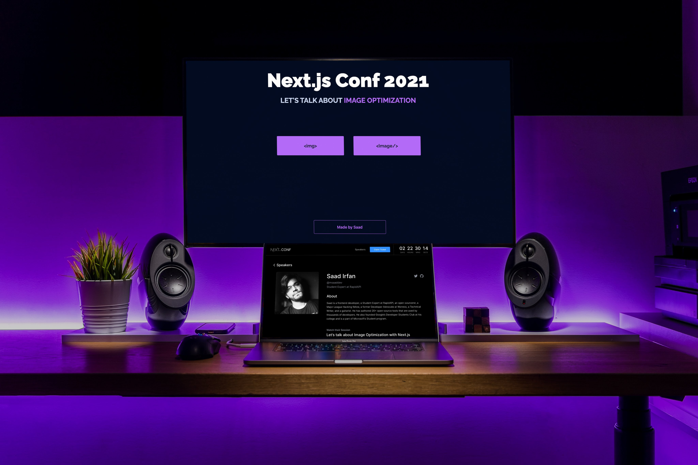

 <h2>⚡️ <a href="https://nextjs.org/conf/speakers/msaaddev">Let's Talk about Image Optimization with Next.js</a></h2>
 <h4><a href="https://nextjs.org/conf/speakers">Next.js Conf 2021</a></h4>

### 🎩 Talk Overview

Because of their size, images are the largest assets of your website. As the size increases, the speed of your web app decreases along with it. According to the HTTP Archive, images make up on average 21% of a total webpage weight. Different image formats also affect your site’s overall performance. In this talk, I am going to speak about how Next.js natively helps you optimize your images. How it provides a built-in solution with its Image component that uses various techniques to make sure your site is fast, consumes less bandwidth, and at the same time has a great user experience.

### 🚀 Purpose

Following are the reasons why I created this demo:

- Explain the issues associated with `` tag and show it live
- Explain the working of `<Image/>` component of Next.js
- Showcase some of the pros of `<Image/>` component over `` tag

## ⚡️ Other Projects

I have curated a [detailed list](https://github.com/msaaddev/open-source) of all the open-source projects I have authored. Do take out a moment and take a look.

## 🔑 License & Conduct

- MIT © [Saad Irfan](https://github.com/msaaddev)
- [Code of Conduct](https://github.com/msaaddev/nextjs-conf-demo/blob/main/CODE-OF-CONDUCT.md)
